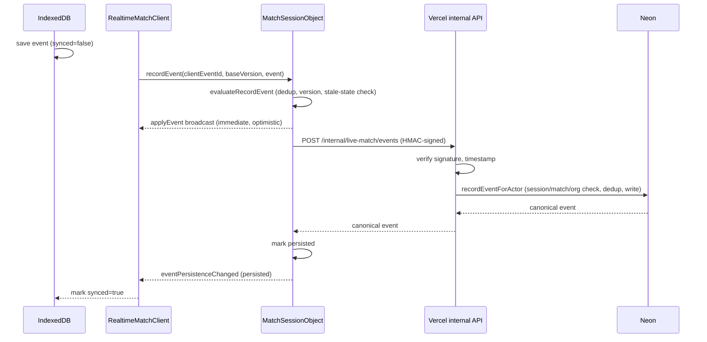

# Live match realtime (Cloudflare Durable Objects)

Live match reporting is normally local-first and HTTP-only (`src/lib/live-match/`). The
live-match-realtime programme adds an optional, additive realtime coordination layer on top
of that using a Cloudflare Worker + Durable Object per active match. See
`docs/adr/0086-live-match-realtime-cloudflare-durable-objects.md` for the architecture
decision (why Cloudflare Durable Objects, the trust boundary, the Free-plan design, and the
HTTP-fallback rollback story) before changing anything here.

## Current status: all 7 stages + "Follow live" viewer complete

This was delivered in stages (see the ADR's linked programme spec), plus one
maintainer-directed addition beyond the original stage plan. As of this document:

- **Shipped**: Stage 1 (protocol types, browser realtime client abstraction — `src/lib/
  live-match/realtime/`) and Stage 2 (`/api/live-match/[matchId]/realtime-ticket`, short-lived
  connection tickets).
- **Shipped**: Stage 3 — the Cloudflare Worker and `MatchSessionObject` Durable Object
  (`workers/live-match/`). One object per match, WebSocket Hibernation API,
  `authenticate`/`getSnapshot`/`recordEvent`/`syncPending`/`endSession` RPC handling, session
  versioning, minimal presence.
- **Shipped in this change**: "Follow live" — a read-only viewer capability (ADR-0086's
  amendment), beyond Stage 3's original scope. A ticket is now issued in one of two modes:
  - `mode: "report"` (default, existing behavior) — the coach actually running the match.
    Requires org mutation role **and** `GROUP_COACH` role on the match's `FootballGroup`
    (`requireMatchGroupMutationRole()`, new — closes a gap where a `GROUP_VIEWER`-role coach
    with an org-mutation-capable role could otherwise report). Capability: `["report"]`.
  - `mode: "view"` — a second coach following along read-only. Requires only group access
    (`GROUP_COACH` or `GROUP_VIEWER`, no org-mutation-role requirement). Capability:
    `["view"]`.
  `MatchSessionObject` now enforces capabilities server-side: `recordEvent`/`endSession`
  reject any connection without `"report"` (previously unenforced — any authenticated
  connection could mutate). The reporting page
  (`src/components/live-match/league-live-match-client.tsx`) opens a `"report"`-mode
  connection so viewers see live updates; at the time this capability shipped, that connection
  was a best-effort broadcast alongside an unconditional HTTP write — Stage 5 (below) later
  made it the primary write path instead. The viewer itself is
  `src/components/live-match/follow-live-client.tsx`, reached via "Follow live" on the match
  detail page (shown only when a session is `ACTIVE` and the coach has at least `GROUP_VIEWER`
  access — enforced server-side, not just hidden in the UI).
- **Shipped**: Stage 4 — signed internal persistence API (SPEC.md §17-19). The Durable
  Object's `handleRecordEvent` now signs and sends accepted events to a new
  `POST /api/internal/live-match/events` (HMAC-only, never a browser-facing API), which calls
  the same `recordEventForActor()` the browser-facing `recordEvent()` wrapper uses, writing
  the canonical event to Neon and deduplicating by `clientEventId`. On success,
  `persistenceStatus` becomes `"persisted"` and `eventPersistenceChanged` broadcasts to all
  connections; on failure it stays `"pending"` (retry/backoff is Stage 6's outbox, not built
  yet). A `GET /api/internal/live-match/snapshot` endpoint also exists (returns canonical
  session status + events for a match/session) — built now per SPEC.md §17, but nothing calls
  it yet; the Durable Object *consuming* it for reconciliation is Stage 6 (§23). A direct,
  now-resolved consequence of Stage 4 landing: `endSession` can succeed for a session whose
  events have actually persisted, which was structurally impossible before this stage.
- **Shipped**: Stage 5 — realtime event path integration (SPEC.md §5, §20, §22, §27, §28).
  The reporting coach's own write path (`createLeagueActions.recordEvent` in
  `league-live-match-client.tsx`) now tries realtime first via `tryRecordEvent()` and only
  falls through to the existing, byte-for-byte-unchanged HTTP path
  (`recordLiveEventAction`) when realtime is unavailable, the RPC throws/rejects, or
  persistence comes back `"pending"` (a deliberate immediate corrective write, safe due to
  `clientEventId` dedup — see ADR-0086's Stage 5 subsection for the full reasoning). A second
  reporter's `applyEvent`/`presenceChanged`/`sessionEnded` broadcasts now trigger an immediate
  refresh via a new `LiveMatchActions.onLiveUpdate` subscription instead of waiting up to 5s
  for the existing poll, and the browser `online`/`visibilitychange` handlers now also force
  an immediate realtime reconnect (`LiveMatchActions.reconnectRealtime`) rather than waiting on
  the client's own backoff timer. No changes to `RealtimeMatchClient` itself (Stage 1) or to
  the HTTP fallback path's own behavior.
- **Shipped**: Stage 6 — reliability (SPEC.md §21, §23, §29). A retryable canonical-persistence
  failure (5xx, or no response at all) leaves the event `"pending"` with an exponential
  backoff (`computeBackoffDelayMs`, 1s base doubling to a 60s cap) and (re)arms the Durable
  Object's single alarm slot for the earliest still-due retry (`nextAlarmTime`) — one alarm
  firing sweeps every currently-due event, never one alarm per event. A terminal
  domain-validation failure (4xx — `LiveMatchDomainError`, `live-match-event-store.ts`) is
  classified separately (`classifyPersistenceFailure`) and marked `"failed_terminal"`
  immediately, with no retry ever scheduled; `RecordEventResult`/`PersistenceChangedCallback`
  both now carry `"failed_terminal"` as a real outcome, not just `"pending"`/`"persisted"`.
  `handleAuthenticate`'s `"initialize"` outcome now reconciles against the internal snapshot
  endpoint (`evaluateReconciliation`) — canonical events the HTTP fallback wrote while this
  object was disconnected (or never existed yet) are assigned a realtime version and folded
  into this object's own storage, so `handleGetSnapshot` returns a genuinely complete event
  list instead of Stage 3/4's placeholder empty array. `endSession` can now resolve for real
  once a previously-pending event's retry succeeds (end-to-end tested, not just structurally
  possible).
- **Shipped**: Stage 7 — production hardening (SPEC.md §31, §32, §35, §42). Message size
  limits (64 KiB) and protocol-version rejection (`PROTOCOL_UNSUPPORTED`) were already built
  and tested in Stage 1 (`protocol-schemas.ts`) — confirmed still correctly enforced and that
  the browser client's generic RPC-rejection fallback covers this error code too. Structured
  logging added on both sides: the Worker's `console.error`/`console.log` calls are now JSON
  objects (ids/status/timing only, per §32's never-log list — no secrets, signatures, or full
  payloads), and the internal Vercel routes log `latencyMs`/`errorCode` alongside the existing
  correlation ids. This document's "Architecture walkthrough" section below is §42's required
  documentation deliverable.
- **Explicitly out of scope**: PWA push notifications (service worker, Web Push) — discussed
  and deferred; "Follow live" is in-browser only for now, per `AGENTS.md`'s PWA section's
  existing v1 scope boundary.

## Local development

```bash
npm run dev:realtime   # wrangler dev --config workers/live-match/wrangler.jsonc --port 8787
```

This does not replace `npm run dev` — run both side by side:

```text
Next.js            http://localhost:3333
Realtime Worker     ws://localhost:8787
```

`workers/live-match/wrangler.jsonc`'s top-level (no `--env`) config is the local-dev
default, with `MATCHBOARD_APP_ORIGINS`/`MATCHBOARD_API_BASE_URL` both set to
`http://localhost:3333`. The Worker also needs `LIVE_MATCH_REALTIME_SECRET` and (Stage 4)
`LIVE_MATCH_INTERNAL_SECRET` set locally to the same values as the Next.js app's own `.env` —
Wrangler reads Worker secrets from a local `.dev.vars` file
(`workers/live-match/.dev.vars`, gitignored) for `wrangler dev`, not from the repository's
root `.env`:

```text
# workers/live-match/.dev.vars (not committed)
LIVE_MATCH_REALTIME_SECRET=same-value-as-root-.env
LIVE_MATCH_INTERNAL_SECRET=same-value-as-root-.env
```

## Deployed environments

Two separately-deployed Workers, matching the existing `matchboard`/`matchboard-test` Vercel
project split (ADR-0086):

| Environment | Worker name | Custom domain |
|---|---|---|
| Production | `noisy-snowflake-faf0` | `realtime.matchboard.football` |
| Test | `gentle-rice-ba83` | `realtime-test.matchboard.football` |

Both custom domains and their Workers already exist in the real Cloudflare account
(ADR-0086's History) — created via the dashboard's "Hello World" flow, which assigns
Cloudflare's own auto-generated adjective-noun name rather than a chosen one. `wrangler.jsonc`'s
`env.production.name`/`env.test.name` are pinned to these exact existing names so
`npx wrangler deploy --env <name>` replaces the Worker in place (keeping its already-attached
custom domain) instead of creating a new, unrelated Worker. Deploys run automatically via
`.github/workflows/deploy-live-match-worker.yml` after every CI-green push to `main` — no
manual `wrangler deploy` step.

Two Worker secrets, two different provisioning stories:
- `LIVE_MATCH_REALTIME_SECRET` must be set per environment via `wrangler secret put
  LIVE_MATCH_REALTIME_SECRET --config workers/live-match/wrangler.jsonc --env production`
  (and again with `--env test`) — a one-time, human-run step independent of code deploys,
  mirroring how `AUTH_SECRET` is already set by hand in Vercel's dashboard
  (`docs/security/secret-rotation-procedures.md`) — no vault is in use for either.
- `LIVE_MATCH_INTERNAL_SECRET` (Stage 4) is different: `deploy-live-match-worker.yml` reads it
  from two GitHub Actions secrets (`LIVE_MATCH_INTERNAL_SECRET_PRODUCTION`/`_TEST`) and pushes
  it to each Worker via `wrangler secret put` automatically on every deploy — no manual
  `wrangler secret put` needed for this one. The two GitHub secrets themselves are still a
  one-time human-set step (same as any repository secret), and must match the corresponding
  Vercel `LIVE_MATCH_INTERNAL_SECRET` env var exactly, per environment.

## Project layout and why it's separate from the main app

```text
workers/live-match/
    wrangler.jsonc
    tsconfig.json        # separate from the root tsconfig — Workers runtime types, not DOM
    vitest.config.ts      # separate from the root vitest config — no TEST_DATABASE_URL needed
    src/
        index.ts               # routing/validation only: Origin allowlist, matchId shape, WS upgrade
        match-session-object.ts # the Durable Object: all session/protocol logic
        state.ts                # pure decision functions (no Workers runtime dependency)
        rpc.ts                   # RPC envelope construction helpers
        auth.ts                  # ticket verification + Origin/matchId validation
        internal-client.ts       # Stage 4: signs + sends persistence/snapshot requests to Vercel
        worker-types.ts          # Env bindings
    test/
        state.test.ts
        auth.test.ts
        rpc.test.ts
        internal-client.test.ts
        match-session-object.test.ts  # Stage 6: class-level orchestration (alarm sweep, reconciliation)
```

Stage 4 also added, on the main Next.js side:

| File | Purpose |
|------|---------|
| `src/lib/live-match/realtime/internal-signature.ts` | Shared HMAC sign/verify (Web Crypto, used by both the Worker and Vercel) |
| `src/lib/live-match/realtime/internal-auth.ts` | Vercel-side `verifyInternalRequest()` — raw-body HMAC verification |
| `src/app/api/internal/live-match/events/route.ts` | `POST` — HMAC-only internal endpoint, calls `recordEventForActor()` |
| `src/app/api/internal/live-match/snapshot/route.ts` | `GET` — HMAC-only internal endpoint, canonical session/events for reconciliation |

The root `tsconfig.json` excludes `workers/` entirely — Workers runtime types
(`@cloudflare/workers-types`) are not compatible with the main app's `dom` lib, so they are
type-checked as a fully separate TypeScript project (`npm run typecheck:workers`). The root
`vitest.config.ts` only includes `src/**/*.test.ts`, so this Worker's own tests run via a
separate config (`npm run test:workers`) rather than the main `npm test` gate — the same
pattern already used for `vitest.config.components.ts`.

Shared application protocol code (`src/lib/live-match/realtime/protocol.ts`,
`protocol-schemas.ts`, `realtime-messages.ts`, `realtime-ticket.ts`) is imported directly by
relative path from `workers/live-match/`, not duplicated — none of it depends on Next.js,
React, or a running Prisma client (the one Prisma-derived type it touches,
`MatchPeriod`, is a type-only import, erased at build time).

## Test coverage — what is and isn't covered

- **Covered by plain Vitest** (`npm run test:workers`): every decision `state.ts` makes
  (event classification, authenticate/re-arm/mismatch outcomes, record-event idempotency and
  version assignment, stale-state rejection, end-session pending-persistence gating), the
  Worker's Origin/matchId validation helpers, and RPC envelope construction. These need zero
  Workers runtime and are the highest-value tests for this stage's actual logic.
- **Stage 4 additions**: HMAC sign/verify round-trip (including tampered-body, wrong-secret,
  stale-timestamp, and boundary-timestamp cases) — `internal-signature.test.ts`, zero Workers
  runtime needed (`crypto.subtle` works identically in Node). Both internal routes have full
  request-level tests including a real end-to-end signature computed and verified through the
  actual route handler, not just mocked-away. `recordEventForActor()` has direct integration
  tests against a real test database (session/match/org consistency, dedup, explicit-actor
  usage with no `requireActorContext()` call) alongside the pre-existing `recordEvent()`
  tests, proving the refactor didn't change browser-facing behavior.
- **Stage 5 additions** (`src/components/live-match/__tests__/`, plain Vitest against jsdom
  via `vitest.config.components.ts` — no real WebSocket needed, `RealtimeMatchClient` is
  faked): the primary/fallback decision in `createLeagueActions.recordEvent` (persisted skips
  HTTP; pending, unavailable, and thrown-rejection cases all fall through to HTTP), the
  `STALE_STATE` self-heal in `useLiveRealtime.tryRecordEvent`, `onLiveUpdate` firing for
  `applyEvent`/`presenceChanged`/`sessionEnded` and stopping after unsubscribe,
  `getSnapshot`-driven version re-derivation on reconnect, `reconnectNow`'s no-new-client
  behavior, and `LiveMatchClient`'s own wiring of `onLiveUpdate`/`reconnectRealtime` (immediate
  refresh on broadcast, immediate reconnect attempt on the browser `online` event).
- **Stage 6 additions**: `classifyPersistenceFailure`/`computeBackoffDelayMs`/
  `selectDueRetries`/`nextAlarmTime`/`evaluateReconciliation` (`state.ts`) are all pure and
  fully covered the same way as every prior stage's decision logic. Beyond that,
  `match-session-object.test.ts` exercises the *real* `MatchSessionObject` class end to end —
  `webSocketMessage` → `dispatch` → `handleRecordEvent`/`handleAuthenticate`/`alarm()` — not a
  reimplementation of its logic. This still does not use `@cloudflare/vitest-pool-workers`/
  Miniflare (re-evaluated a third time at Stage 6, the trigger Stage 3/4 both named for
  revisiting this — see ADR-0086's Stage 6 amendment for the fuller reasoning); instead,
  `cloudflare:workers` (unresolvable outside the real Workers runtime) is mocked with a
  minimal `DurableObject` base class, and Durable Object storage/WebSocket primitives are
  hand-rolled in-memory fakes (a `Map`-backed storage supporting `get`/`put`/`delete`/
  `setAlarm`/`deleteAlarm`/`getAlarm`, and a fake `WebSocket` supporting `serializeAttachment`/
  `send`/`close`). Tickets are genuinely signed with the real `signRealtimeTicket` (pure
  crypto, no I/O) rather than faked, so `verifyRealtimeTicket` inside `handleAuthenticate` is
  exercised for real too. This proves the alarm sweep's actual storage mutations (retry count,
  `nextRetryAt`, terminal vs. persisted transitions, alarm scheduling/clearing) and
  reconciliation's actual effect on a subsequent `getSnapshot` call, using the real class —
  meaningfully more than pure-function tests alone, without adopting the full Miniflare
  toolchain. What this still doesn't cover: WebSocket upgrade handling and hibernation
  survival themselves (the literal `WebSocketPair`/`ctx.acceptWebSocket` platform mechanics,
  which have no Node equivalent to fake credibly) — `npx wrangler deploy --dry-run` and manual
  verification via `npm run dev:realtime` against a real local Worker runtime remain the
  substitute for that specific gap.
- **Stage 7 additions**: a test confirming `useLiveRealtime.tryRecordEvent` falls through
  (returns `null`, so `createLeagueActions.recordEvent` falls through to HTTP) on a
  `PROTOCOL_UNSUPPORTED` rejection specifically, not just the generic-rejection case already
  covered. Message-size and protocol-version enforcement themselves were already tested in
  Stage 1 (`protocol-schemas.test.ts`).

## Architecture walkthrough (SPEC.md §42)

### The four concepts and how they relate

- **`Match`** — the durable, canonical Matchboard fixture (Prisma model). Exists whether or
  not it is ever reported live.
- **`LiveMatchSession`** — one reporting session for a `Match` (start/end timestamps, status).
  A `Match` may have zero or more `LiveMatchSession`s over time (e.g. a re-opened report).
  This is the row `MatchSessionObject` authenticates against and the row `endSession`
  ultimately reflects.
- **`MatchSessionObject`** — the Cloudflare Durable Object actor coordinating exactly one
  currently-active `LiveMatchSession` in real time (`env.MATCH_SESSIONS.idFromName(matchId)`
  — keyed by `matchId`, so a match's object persists conceptually across a session's
  start/end, but its *storage* is cleared and re-initialized each time a genuinely new session
  authenticates — see "Version semantics" below).
- **`MatchClientCapability`** — SPEC.md's name for the server→browser RPC interface
  (`applySnapshot`/`applyEvent`/`eventPersistenceChanged`/`presenceChanged`/`sessionEnded`/
  `forceResync`, `protocol.ts`'s `CLIENT_METHODS`) — not a permission concept despite the
  name; ticket **capabilities** (`"report"`/`"view"`, a separate and unrelated string field on
  the connection ticket) are what actually gates who may call `recordEvent`/`endSession`.

### Responsibility boundaries

| Layer | Answers | Never |
|---|---|---|
| IndexedDB (browser) | "What has this device recorded that Neon hasn't confirmed yet?" | Business truth beyond this one device's unsynced queue |
| `MatchSessionObject` (Durable Object) | "Who's connected, what order were actions accepted in, what's still waiting on Neon?" | A second season history database — storage is minimal and short-lived (SPEC.md §15) |
| Neon (via the internal API) | "What actually happened? Which events are canonical?" | Realtime coordination — Neon has no idea a WebSocket exists |

**Why the Durable Object is not another source of business truth** (SPEC.md §42's own explicit
requirement — ADR-0086's "What system of record still means" section makes the same argument
in more detail, referenced rather than repeated here): the object's `version` counter and
`AcceptedEventRecord` storage exist purely to answer realtime-coordination questions —
ordering, dedup, "is this client caught up." Every one of those records is disposable: if the
object were destroyed and recreated from scratch, `reconcileFromCanonicalSnapshot` would
rebuild an equivalent (if renumbered) view purely from what Neon already has. Nothing a coach
or parent ultimately sees — season stats, match reports, fairness calculations — ever reads
from Durable Object storage; all of it reads Neon, via the exact same domain code
(`recordEventForActor`, `getMatchEvents`, etc.) whether the event arrived via HTTP or realtime.

### End-to-end flow



**Where HTTP fallback re-enters**: if `RC->>DO` never happens (no connection) or the RPC call
itself throws, the browser calls the existing `recordLiveEventAction` (HTTP) directly instead
— skipping the Durable Object entirely and going straight to the same `recordEventForActor` the
internal API also calls. If the Durable Object *did* accept the event but the `DO->>API` leg
failed (Vercel/Neon temporarily down), the browser's realtime result comes back
`persistenceStatus: "pending"`, and Stage 5's client-side logic immediately also calls the
HTTP path as a corrective write — safe regardless of whether the Durable Object's own attempt
partially succeeded, because `recordEventForActor`'s `clientEventId` dedup means at most one
canonical Neon row is ever created no matter how many paths attempt it (SPEC.md §22 Case E).
Independently, Stage 6's alarm-driven retry (`alarm()`) will also keep attempting the same
call on the Durable Object's own schedule until it succeeds or is classified terminal — the
two retry paths (immediate client-side, and the Durable Object's own backoff) are complementary,
not conflicting: whichever succeeds first wins, and the dedup makes either order safe.

### Authentication flow

1. Browser calls `POST /api/live-match/[matchId]/realtime-ticket` with `{ mode: "report" |
   "view" }` — authenticated via the normal session cookie, authorized via
   `requireMatchGroupMutationRole` (report) or `requireMatchGroupAccess` (view).
2. Vercel issues a short-lived (60-120s) JWT ticket (`LIVE_MATCH_REALTIME_SECRET`) carrying
   `userId`/`organisationId`/`matchId`/`sessionId`/`capabilities`.
3. Browser opens a WebSocket to the Worker; the connection starts **unauthenticated** — the
   only RPC it may call is `authenticate`.
4. `authenticate` verifies the ticket, checks it matches the object's own routed `matchId` and
   (if a session is already active) `sessionId`/`organisationId`, and — on first
   authentication for a session — runs reconciliation (see below).
5. Every subsequent RPC trusts only the connection's own server-attached identity
   (`ConnectionAttachment`, populated once at authenticate time), never anything the browser
   sends as RPC parameters (SPEC.md §13, §35).
6. The Worker→Vercel leg is a *separate* trust boundary: `LIVE_MATCH_INTERNAL_SECRET` (never
   the ticket secret) signs each request via HMAC-SHA256 over `<timestamp>.<raw body>` (or, for
   the snapshot `GET`, `<timestamp>.<query string>` — binding the signature to exactly which
   match/session is being asked for, not just that *some* valid Worker request arrived).

### Version semantics

The Durable Object's `version` counter is **coordination metadata**, not a business sequence
number (SPEC.md §23) — it exists only so connected clients can detect gaps ("I'm at version 5,
I just received version 8, I'm missing something — request a fresh snapshot") and so
state-sensitive actions (period transitions, rotations) can be rejected as stale when another
client already moved the match forward. It resets to 0 every time `evaluateAuthenticate`
returns `"initialize"` — either a truly fresh object, or re-arming for a *new*
`LiveMatchSession` after the previous one ended. `clientEventId` is the durable, cross-session
idempotency key that survives this reset (it's what Neon's own dedup keys on); realtime
`version` never is.

### Failure handling summary

| Failure | What happens |
|---|---|
| WebSocket unavailable | HTTP fallback handles everything; realtime never re-enters (SPEC.md §22 Case A) |
| Durable Object accepts, Vercel/Neon down | Event stays `"pending"`; Stage 6 alarm retries with backoff; client-side immediate HTTP write also attempts it (§22 Case B) |
| Domain-validation failure (4xx) | `"failed_terminal"` immediately, never retried, clients notified via `eventPersistenceChanged` |
| Entire network down | IndexedDB records locally; replays on reconnect (§22 Case C/D) |
| Duplicate delivery (HTTP + realtime both eventually try the same event) | `clientEventId` dedup guarantees exactly one canonical row (§22 Case E) |
| Reconnect after being offline | Fresh ticket, reconnect, authenticate (reconciles if a new session), `getSnapshot`, replay unsynced local events (§27) |
| Protocol version mismatch | `PROTOCOL_UNSUPPORTED`; browser falls through to HTTP exactly like any other RPC rejection |
| Oversized message | Rejected before JSON parsing (`MESSAGE_TOO_LARGE`, 64 KiB limit, Stage 1) |
| Match ends with pending events | Blocked (`PERSISTENCE_UNAVAILABLE`) until they resolve — never silently discarded (§29) |

See "Local development" and "Deployed environments" above for the operational
configuration side of this walkthrough.
